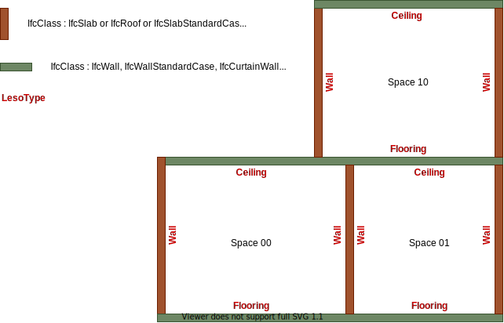

Les LesoType se rapportent aux types présents dans Lesosai. En effet l'IfcClass d'un élément ne 
suffit pas toujours à déterminer quel type appliquer. 
Par exemple pour un IfcSlab le LesoType «Ceiling» sera appliqué si la surface pointe vers le haut
Alors que le LesoType «Flooring» sera applique si la surface pointe vers le bas.

LesoType :
* Ceiling : Surface au plafond du local. La classe est généralement IfcSlab ou IfcRoof.
* Flooring : Surface au sol du local. La classe est généralement IfcSlab.
* Wall : Surface verticale intérieure ou sur extérieur. La classe est généralement IfcWall.
* Window : Fenêtre, son hôte détermine s'il s'agit d'une fenêtre murale ou de toit 
(puit de lumière etc…). La classe est généralement IfcWindow.
* Door : Porte, son hôte détermine s'il s'agit d'une porte murale ou de toit (ex: accès en toiture).
La classe est généralement IfcDoor.
* Opening : Ouverture qui n'est ni remplie ni par une fenêtre ni par une porte. La classe est 
généralement IfcOpeningElement ou IfcVirtualElement (IFC4) ou inexistant (surface virtuelle IFC2x3).
* Unknown : Type qui n'a pas pu être déterminé par l'algorithme. Cela peut arriver notamment avec 
une surface virtuelle.

Cas spéciaux :
* Murs rideaux : ce type doit être converti en mur contenant une fenêtre occupant 100% de la 
surface. (Cas pas encore traité, à discuter).

Schéma explicatif :

